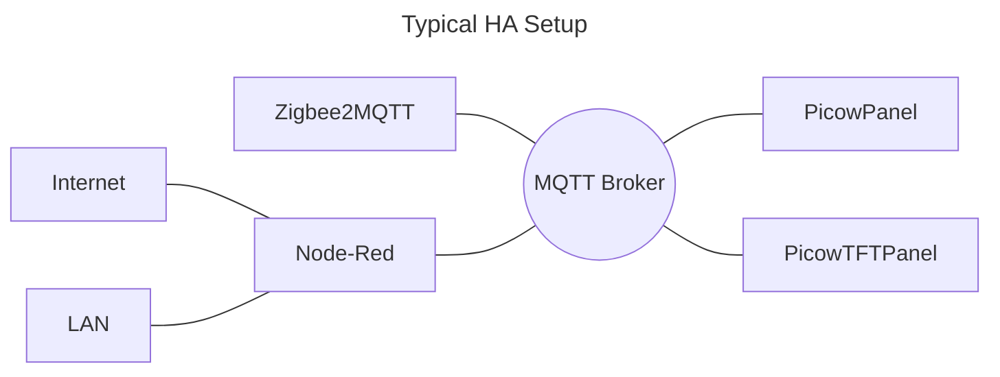

# PicowPanel
An MQTT-driven Pico W-based information panel using a HUB75 RGB LED matrix display.

The code has been tested with both 64x64 and 64x32 panels.

A lot of the code is shared with my similar PicowTFTPanel project.

## Configuration

Rename the `dummy_wifi_config.h` to `wifi_config.h` and edit it to suit your WiFi setup.

* `config.h` has some basic definitions used throughout the code
* `info_items.c` has the specific display items and their MQTT topics
* `mqtt.h` contains the high-level MQTT connection details
* `picowtftpanel.c` has the pin definition for the AM2302 near the top
* `rgb_led_config.h` includes the pin connections and dimensions of the display

